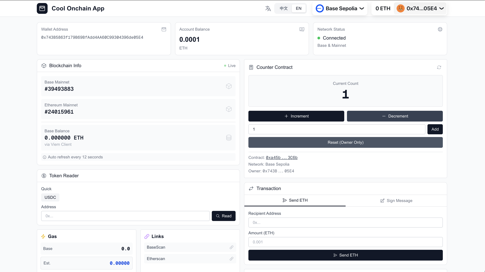

# React Wallet Demo

A simple Web3 wallet connection app built with React, RainbowKit, and Wagmi.

## 🌐 Live Demo

**[https://my-app-wheat-iota-66.vercel.app/](https://my-app-wheat-iota-66.vercel.app/)**



## What it does

- Connect crypto wallets (Rabby, MetaMask, Coinbase, etc.)
- Display wallet address and ETH balance
- Support multiple chains (Ethereum, Polygon, Goerli)

## Tech Stack

- React 18 + TypeScript
- Vite
- RainbowKit + Wagmi
- TanStack Query

## Quick Start

```bash
# Clone and install
git clone https://github.com/fffshiyu/walletdemo.git
cd walletdemo
npm install

# Add your WalletConnect Project ID
echo "VITE_WALLETCONNECT_PROJECT_ID=your_project_id" > .env

# Run
npm run dev
```

Get your Project ID from [WalletConnect Cloud](https://cloud.walletconnect.com)

## Build

```bash
npm run build
npm run preview
```

## License

MIT
